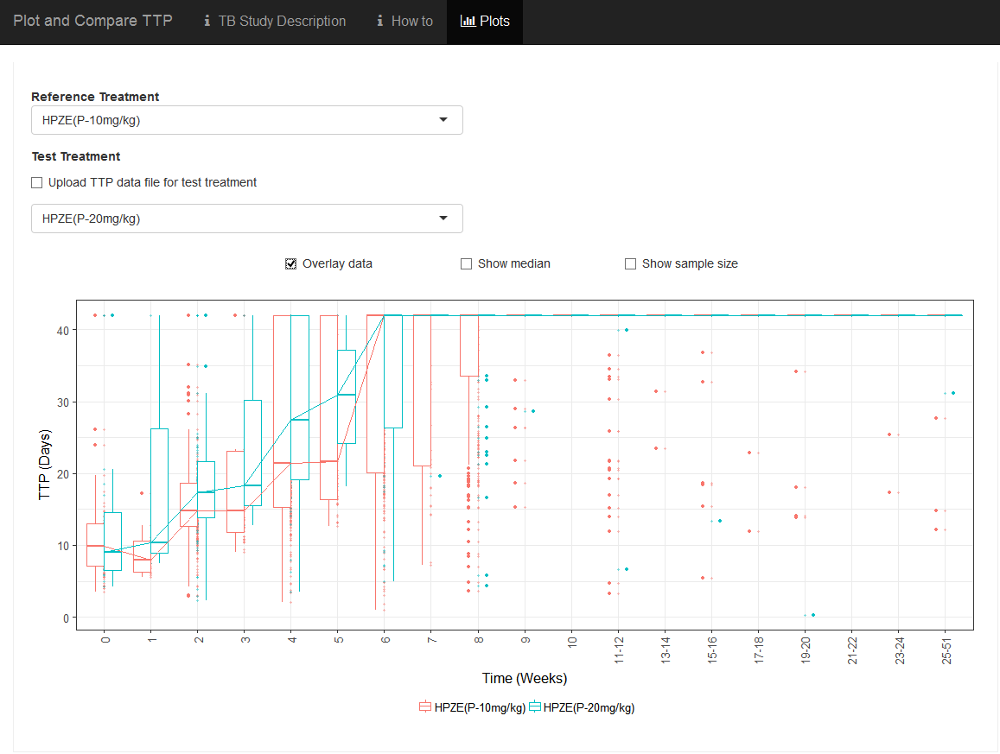
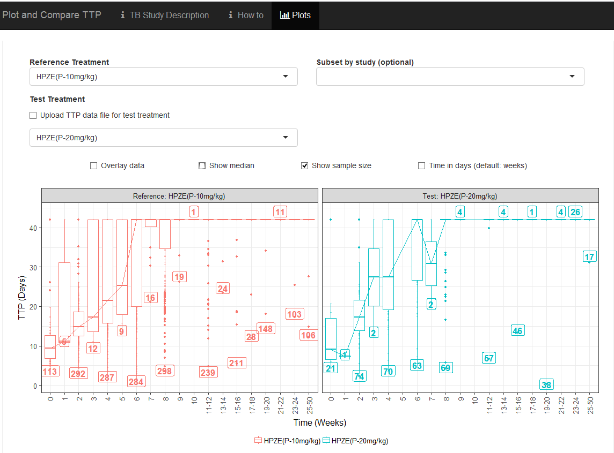
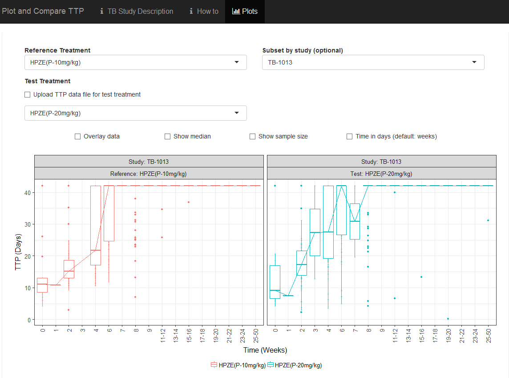
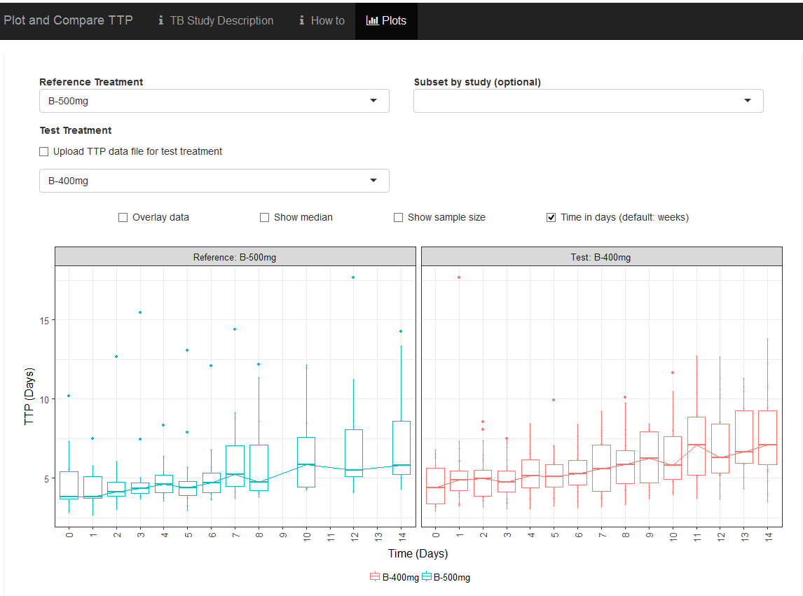

 
###1- How to Perform a Comparison Between Two Treatments in the Database

The application allows the user to perform a comparison of longitudinal TTP between a selected reference and test treatments. TTP data is represented using boxplots.

<div style="text-align: center;">
{ width=30% }
</div>

The user has the choice of presenting longitudinal TTP data of two treatments side-by-side (Example 1) or using the overlay option by clicking on the "Overlay data" check box (Example 2). Numerical values (median and sample size) of TTP can be selected by clicking on the "Show median" and "Show sample size" check boxes (Examples 3 and 4, respectively).
The user can select a specific study from the 11 clinical studies by clicking on the "Subset by study (optional)" check box. If a study is selected, only treatment associated to this study will be available (Example 5).
By default, time is presented by weeks. The user can show time in days by clicking on the "Time in days (default: weeks)" check box (Example 6).  

Example 1: Side-by-side Comparison of treatments


Example 2: Overlaid Comparison of treatments


Example 3: Add TTP median to the plots


Example 4: Add sample size by week (number of TTP observations) to the plots


Example 5: Select a specific study


Example 6: Show time in days instead of weeks which is the default


The above options could be used separate or combined.

###2- How to Perform a Comparison Between a Treatment in the Database and a User-Defined Treatment

The application also allows the user to upload TTP data collected in new clinical trials and perform a comparison to any reference treatment.  The user can upload TTP data by selecting the "Upload TTP data file for test treatment" check box.


A browse button will open a navigation window for the user to select the file to be uploaded.  The uploaded file must be in a comma-separated values (CSV) format with the following headers. 

```{r xtable, echo=FALSE}
knitr::kable (
  data.frame(ID= "ID_XYZ",TIMEDAYS= " ",TTP= " " ,WEEK=" ", WEEKCAT=" " , HIV= " ", CAVITATION=" ",CD4=" ",
             TRTDOSE=" ", TRT=" ", AGE=" ", SEX=" ", RACE=" ", WT=" ", STUDY=" " )
  
)

```

```        

```
Definition of Variables:

* "#ID" = Subject ID (string)
* "TIMEDAYS" = Time of TTP Observation (Days, number)   
* "TTP" = TTP (Days, number)
* "WEEK" = Time of TTP Observation (Week, number)
* "WEEKCAT" = Week categories (string)
* "HIV" = HIV status (Yes/No)
* "CAVITATION" = Presence of cavitation (Yes/No)
* "CD4" = CD4 count (Cells/UL, string)      
* "TRTDOSE" = Treatment name with Dose when available (string)
* "TRT" = Treatment name (string)
* "AGE" = Age (years, number) 
* "SEX" = Sex (Female/Male)
* "RACE" = Race (Asian/Black or African American/Hispanic/Missing/Other/White)
* "WT" = Weight (kg, number)
* "STUDY" = Study name (string)

The current version of the application reads the column "TTP", "TIMEDAYS", "WEEK" and "TRTDOSE" for plotting purposes.  Reading of other fields will be implemented in future versions. 
Missing information can be entered as "." in any field.  

###3- Interpretation of results
An example of how to interpret results is provided based on the data presented in Example 7 below. 
The increase of pyrazinamide dose in the HPZE treatment from 10 mg (red line) to 20 mg (blue line) resulted in a faster rate of TTP progression to negative growth (E.g., at week 4, the TTP rates were 21.5 and 27.5 days for the 10 mg and 20 mg doses, respectively).

Example 7: Result interpretation

